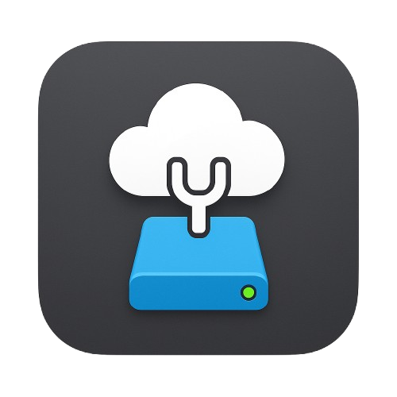

# WebtunelCMounter

<div align="center">
  
  <h1>WebtunelCMounter</h1>
  <p><strong>Modern and elegant cloud storage mounter for macOS</strong></p>
  
  <p>
    <a href="#features">Features</a> •
    <a href="#installation">Installation</a> •
    <a href="#usage">Usage</a> •
    <a href="#supported-protocols">Protocols</a> •
    <a href="#development">Development</a> •
    <a href="#contributing">Contributing</a> •
    <a href="#license">License</a>
  </p>
  
  
  
  
  
</div>

## Features

WebtunelCMounter is an elegant, macOS application that allows you to seamlessly mount various cloud storage and network protocols as local drives. It provides a beautiful, responsive user interface with true macOS integration.

### ✨ Key Features

- **Multiple Protocol Support**: Mount FTP, SFTP, Samba (SMB), and WebDAV services as local drives
- **Native macOS Integration**: Appears in Finder sidebar with proper icons and volume mounting
- **Save Connections**: Store and quickly access your favorite cloud storage locations
- **Menu Bar Access**: Quick access to your saved cloud connections from the macOS menu bar
- **Detailed Logging**: Comprehensive diagnostic tools to troubleshoot connection issues
- **Modern UI**: Beautiful, responsive interface with macOS-inspired design
- **API Access**: RESTful API for programmatic mounting and unmounting

## Installation

### Requirements

- macOS 10.14 (Mojave) or newer
- For certain protocols (FTP, SFTP), macFUSE is required and will be installed if needed
- For SFTP connections specifically, SSHFS is required and will be installed if needed

### Download

Download the latest release from the [Releases page](https://github.com/webtunel/WebtunelCMounter/releases).

### Installation

1. Download the `.dmg` file from the releases page
2. Open the downloaded file
3. Drag WebtunelCMounter to your Applications folder
4. Open WebtunelCMounter from your Applications folder
5. Follow the initial setup to install any required dependencies

### Manual Installation (from source)

1. Clone this repository:
   ```bash
   git clone https://github.com/webtunel/WebtunelCMounter.git
   cd WebtunelCMounter
   ```

2. Install dependencies:
   ```bash
   npm install
   ```

3. Start the application:
   ```bash
   npm start
   ```

## Usage

### Creating a New Connection

1. Open WebtunelCMounter
2. Click the "New" button in the Connections tab
3. Select the connection type (FTP, SFTP, SMB, or WebDAV)
4. Enter the server details and credentials
5. Click "Save Connection"

### Mounting a Connection

1. Select a saved connection from the list
2. Click the "Mount" button
3. The cloud storage will appear in Finder as a local drive
4. Alternatively, use the menu bar icon to quickly mount saved connections

### Managing Active Mounts

1. Switch to the "Active Mounts" tab to see all currently mounted drives
2. Click "Unmount" to safely disconnect from a mounted drive
3. Click "Open" to open the mounted drive in Finder

## Supported Protocols

### FTP (File Transfer Protocol)
- Standard FTP connections
- Anonymous access support
- Passive mode support

### SFTP (SSH File Transfer Protocol)
- Secure file transfers over SSH
- Password authentication
- Private key authentication

### SMB/CIFS (Samba)
- Windows shared folders
- Network Attached Storage (NAS) devices
- Domain authentication support

### WebDAV (Web-based Distributed Authoring and Versioning)
- HTTP/HTTPS WebDAV servers
- Cloud storage providers supporting WebDAV
- NextCloud, ownCloud, and other compatible services

## API Access

WebtunelCMounter also runs a local API server (default port: 3000) that you can use to mount and unmount network shares programmatically:

### Mount FTP Server

```bash
curl -X POST http://localhost:3000/mount/ftp \
  -H "Content-Type: application/json" \
  -d '{
    "host": "ftp.example.com",
    "port": 21,
    "username": "user",
    "password": "pass",
    "mountPoint": "/Volumes/MyFTP"
  }'
```

### Mount SFTP Server

```bash
curl -X POST http://localhost:3000/mount/sftp \
  -H "Content-Type: application/json" \
  -d '{
    "host": "sftp.example.com",
    "port": 22,
    "username": "user",
    "password": "pass",
    "mountPoint": "/Volumes/MySFTP"
  }'
```

### Mount Samba Share

```bash
curl -X POST http://localhost:3000/mount/samba \
  -H "Content-Type: application/json" \
  -d '{
    "host": "fileserver",
    "share": "shared",
    "username": "user",
    "password": "pass",
    "domain": "WORKGROUP",
    "mountPoint": "/Volumes/MySamba"
  }'
```

### Mount WebDAV Server

```bash
curl -X POST http://localhost:3000/mount/webdav \
  -H "Content-Type: application/json" \
  -d '{
    "url": "https://webdav.example.com/dav",
    "username": "user",
    "password": "pass",
    "mountPoint": "/Volumes/MyWebDAV"
  }'
```

### Unmount a Filesystem

```bash
curl -X POST http://localhost:3000/unmount \
  -H "Content-Type: application/json" \
  -d '{
    "mountPoint": "/Volumes/MyFTP"
  }'
```

### List All Mounts

```bash
curl -X GET http://localhost:3000/mounts
```

## Development

### Prerequisites

- Node.js (v16 or newer)
- npm or yarn

### Setup

```bash
# Clone the repository
git clone https://github.com/webtunel/WebtunelCMounter.git
cd WebtunelCMounter

# Install dependencies
npm install

# Start the development server with hot reloading
npm run dev:react
```

### Building for Production

```bash
# Build the application
npm run build

# The packaged application will be in the dist directory
```

## Contributing

Contributions are welcome! Here's how you can contribute:

1. Fork the repository
2. Create a new branch: `git checkout -b feature/amazing-feature`
3. Make your changes
4. Commit your changes: `git commit -m 'Add some amazing feature'`
5. Push to the branch: `git push origin feature/amazing-feature`
6. Open a Pull Request

Please ensure your code follows the project's coding style and includes appropriate tests.

## Troubleshooting

### Common Issues

1. **Cannot mount FTP/SFTP connections**
   - Ensure macFUSE is installed
   - Check if firewall is blocking connections
   - Verify server credentials and connection details

2. **Permission issues with mount points**
   - Mount points in `/Volumes/` are created automatically
   - For custom mount points, ensure you have write permissions to that directory

3. **Connection freezes or disconnects**
   - Check network stability
   - Some networks block specific protocols or ports
   - Try increasing timeout settings

### Debug Logs

WebtunelCMounter includes detailed logging to help troubleshoot issues:

1. Click the debug button (bug icon) in the application
2. View the logs to diagnose connection problems
3. You can copy or download logs to include in bug reports

## License

This project is licensed under the MIT License - see the [LICENSE](LICENSE) file for details.

## Acknowledgements

- [Electron](https://www.electronjs.org/) - Framework for building cross-platform desktop apps
- [React](https://reactjs.org/) - UI library for building component-based interfaces
- [Ant Design](https://ant.design/) - Design system and UI component library
- [macFUSE](https://osxfuse.github.io/) - Filesystem in Userspace for macOS

---

<div align="center">
  <p>Made with ❤️ for macOS users who love the cloud</p>
  <p>© 2025 WebTunel</p>
</div>